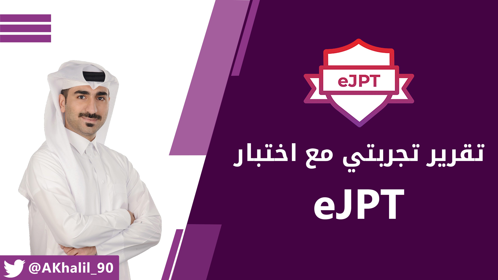
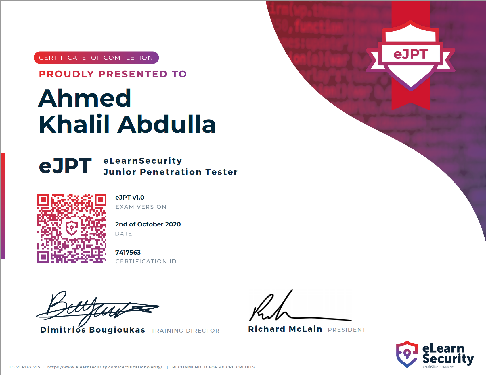

<h1 dir="rtl" align="right">تجربتي مع اختبار eJPT</h1>

<h2 dir="rtl" align="right">مقدمة</h2>

شهادة eJPT أو (eLearn Security Junior Penetration Tester) هي من الشهادات التي تقدم من قبل <a href="https://www.elearnsecurity.com/">eLearn Security</a>. تعتبر شهادات eLean Security من الشهادات الحديثة في مجال أمن المعلومات والتي تغطي مجموعة واسعة من التخصصات الدفاعية والهجومية ضمن منظومة أمن المعلومات (<a href="https://www.elearnsecurity.com/certification/">رابط بقائمة الشهادات</a>) ، ولا تمتلك الصدى الكبير الذي تملكه الشهادات الأخرى مثل شهادات CEH أو Security+ أو CISSP، ولكنها وفي الآونة الأخيرة بدأ الإقبال يتزايد عليها وعلى كورساتها، مما أكسبها شعبية في هذا المجال، ومن المتوقع أن تنافس شهادات eLearn Security الشهادات الموازية في المستقبل القريب، ويرجع السبب في ذلك هو اعتماد التطبيق العملي في الكورسات وفي الاختبارات خصيصا بنسبة 100%.

&nbsp;

رجوعا للحديث عن شهادة eJPT، فتعتبر هذه الشهادة من الشهادات الابتدائية في مجال الاختراق الأخلاقي، وهي مناسبة لأي شخص جديد في مجال الأختراق الاخلاقي ويبحث عن نقطة بداية للدخول في هذا المجال الواسع. كما أن eLearn Security تقدم كورس واختبار أعلى مستوى من eJPT وهو eCPPT وهو ما يشبهه بعض المختصين بإختبار OSCP المقدم من Offensive Security.

&nbsp;

<h2 dir="rtl" align="right">متطلبات الشهادة</h2>

&nbsp;

<h2 dir="rtl" align="right">هل هناك كورس محدد لهذه الشهادة؟</h2>

نعم. تقدم eLearn Security كورس <a href="https://www.elearnsecurity.com/course/penetration_testing_student/">PTS</a> أو (Penetration Tester Student) والذي يؤهلك وبشكل كامل لإجتياز اختبار eJPT بنجاح. تعتبر كورسات eLearn Security من الكورسات الجميلة والتي تقوم بشرح المادة والمواضيع بأسلوب واضح وسهل ويساعد على التطبيق العملي بشكل كبير بعيدا عن التركيز على التعمق في الأمور النظرية فقط.

&nbsp;

يحتوي الكورس على 15 وحدة مقسمة على 3 أقسام رئيسية كالتالي:

<ol dir="rtl">
<li><strong>Preliminary Skills - Prerequisits:</strong> يحتوي هذا القسم على (4) وحدات تغطي جزيئة المقدمة، والشبكات، وتطبيقات الويب، ومبادئ اختبار الاختراق.</li>
<li><strong>Preliminary Skills - Programming:</strong> يحتوي هذا القسم أيضا على (4) وحدات تغطي مواضيع البرمجة بلغات ++C و Python و Bash Scripting (هذه الوحدات لن تغطى في الاختبار، ولكنها تدرس ضمن الكورس للمعرفة).</li>
<li><strong>Penetration Testing:</strong> يعتبر هذا القسم هو القسم الأهم في المنهج بشكل كامل حيث ينقسم إلى (7) وحدات رئيسية، وتعظي المواضيع التالية: Information Gathering و Footprinting and Scanning و Vulnerability Assessment و Web Attacks و System Attacks و Networks Attacks.</li>
</ol>

&nbsp;

كما أن كل من الوحدات المذكورة تحتوي على عروض تقديمية (سلايدات) تفصيلية للمادة، وفيديوهات تعليمية، بالإضافة إلى لابات عملية تساعدك على فهم المادة المشروحة بشكل عميق من خلال التطبيق العملي.

&nbsp;

<h2 dir="rtl" align="right">ماهي تكلفة كورس PTS؟</h2>

توفر eLearn Security باقات بتفاصيل مختلفة، وهي كالتالي:

<ul dir="rtl">
<li><strong>Barebone (التكلفة: مجانية):</strong> تحصل في هذه الباقة على صلاحيات الدخول على العروض التقديمية للكورس فقط، ومن دون الحصول على صلاحيات الدخول على الفيديوهات أو اللابات العملية أو قسيمة تقديم الاختبار.</li>
<li><strong>Full (التكلفة: 399 دولار أمريكي):</strong> في هذه الباقة يحصل المستخدم على جميع صلاحيات الدخول على العروض التقديمية والفيديوهات وصلاحية الدخول على اللابات التعليمية لمدة (30) ساعة، بالإضافة إلى قسيمة تقديم الاختبار مع إمكانية إعادة الاختبار لمرة واحدة في حال لم تنجح في الاختبار من المرة الأولى.&nbsp;كما أنه يجب عليك خوض الاختبار ضمن (6) أشهر من شرائك للباقة.</li>
<li><strong>Elite (التكلفة: 499 دولار أمريكي):</strong> في هذه الباقة يحصل المستخدم على جميع الصلاحيات الموجودة في باقة Full، بالإضافة إلى إمكانية تحميل العروض التقديمية للمادة على شكل PDF على الجهاز، وعدد (120) ساعة للابات العملية عوضا عن (30) ساعة، كما أن قسمية الاختبار غير منتهية الصلاحية، مما يمكنك من تقديم الاختبار في أي وقت تريد. كما أنه يمكنك إعادة الاختبار لعدد (3) مرات في حال لم تتمكن من اجتيازه في المرات السابقة.</li>
</ul>

&nbsp;

شخصيا، قمت بشراء باقة (Full) وذلك بسبب أن عدد (30) ساعة للابات يعتبر أكثر كاف للتطبيق العملي، والسبب الأهم هو أني أريد ربط نفسي بموعد نهائي لتقديم الاختبار والحصول على الشهادة، عوضا عن ضمان قسيمة اختبار غير منتهية الصلاحية!

&nbsp;

<h2 dir="rtl" align="right">وماذ عن الاختبار؟</h2>

توفر eLearn Security باقات بتفاصيل مختلفة، وهي كالتالي:

<ul dir="rtl">
<li><strong>طريقة تقديم الاختبار:</strong> يقدم الاختبار عن طريق الاونلاين فقط وفي أي وقت تريد من دون الحاجة لعمل جدولة للاختبار، كما أنك ستكون وحدك ومن دون مراقب.</li>
<li><strong>آلية الاختبار:</strong> بمجرد بدء الاختبار، سيتم إرسال ملف تعريف OpenVPN يمكنك بالربط مع شبكة الاختبار، كما سيصلك Letter of Engagement يشرح لك ماهو المطلوب منك في هذا الاختبار. ستحتاج لتطبيق بأغلب الأمور التي تعلمتها في الكورس بشكل عملي لاختراق الأجهزة والتطبيقات في الشبكة للحصول على إجابات عدد (20) سؤال.</li>
<li><strong>درجة النجاح:</strong> لكي تنجح في الاختبار، ستحتاج للإجابة بشكل صحيح على عدد (15) سؤال من أصل (20). ستحصل على النتيجة بشكل فوري حال الانتهاء من الاختبار.</li>
<li><strong>مدة الاختبار:</strong> يمتد الاختبار لفترة (72) ساعة. نعم، (3) أيام. يبدء عداد الوقت بالعمل بمجرد البدء في الاختبار. يجزم الكثير بأنك لن تحتاج لكل هذا الوقت لاجتياز الاختبار بنجاح في حال قمت بفهم المنهج واللابات العملية بالشكل المطلوب.</li>
</ul>

&nbsp;

<h2 dir="rtl" align="right">تجربتي الشخصية مع الاختبار؟</h2>
<ul dir="rtl">
<li>بدأت الاختبار يوم الجمعة، الموافق (02/10/2020)، في تمام الساعة (1:30) صباحا.</li>
<li>جميع ما واجهته في الاختبار مرتبط تماما بالمنهج الذي تم تغطيته في الكورس واللابات العملية. إن اتقنت المواد المطروحة في الكورس، فلن تواجه صعوبة في الاختبار بإذن الله.</li>
<li>استمعت كثيرا خلال تقديمي للاختبار، حيث أنك تقوم بإستخدام معظم الأدوات وبطريقة جميلة ومترابط تساعد المتقدم للاختبار في تطبيق ما تعلمه من أساسيات ومنهجية اختبار الاختراق الأخلاقي.</li>
<li>انتهيت الاختبار في تمام الساعة (5:00) صباحا، وحصلت على درجة 19/20.</li>
</ul>

<h2 dir="rtl" align="right">مقتطفات أخرى</h2>
<ol dir="rtl">
<ol dir="rtl">
<ul dir="rtl">
<li>مقارنة بإختبارات CEH و Security+ أو غيرها من شهادات أمن المعلومات، من وجهة نظري بأن اختبار ومنهج eJPT من أمتعها، حيث أنك ستتعلم التطبيق العملي وستطبيق في اللابات وفي الاختبار كذلك، مما سيمنحك ثقة أكبر في قدراتك ومعلوماتك في المجال.</li>
<li>لا تتوقف عند شهادة eJPT في مجرد البداية في مجال اختبار الأختراق الأخلاقي، اتجه إلى eCPPT أو OSCP!</li>
</ul>
</ol>
</ol>
<h2 dir="rtl" align="right">التواصل</h2>

يمكنك التواصل معي على تويتر: <a href="https://www.twitter.com/AKhalil_90">@AKhalil_90</a>

